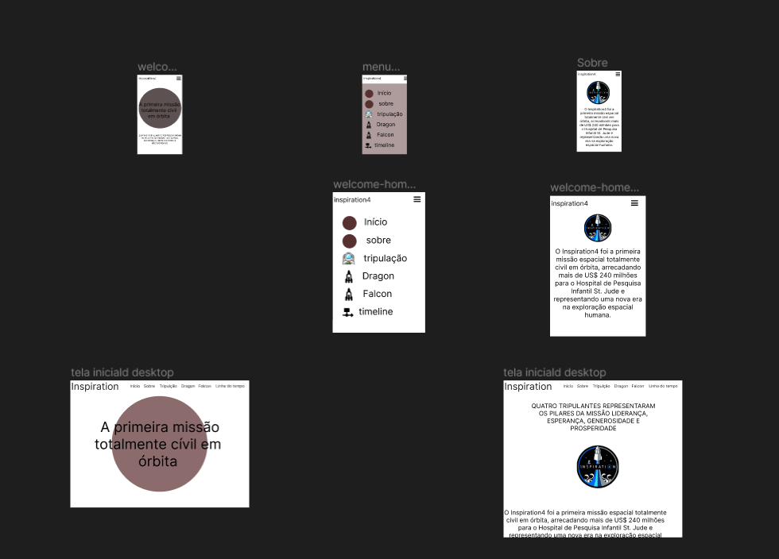
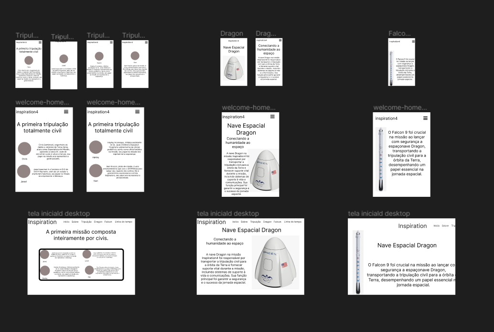
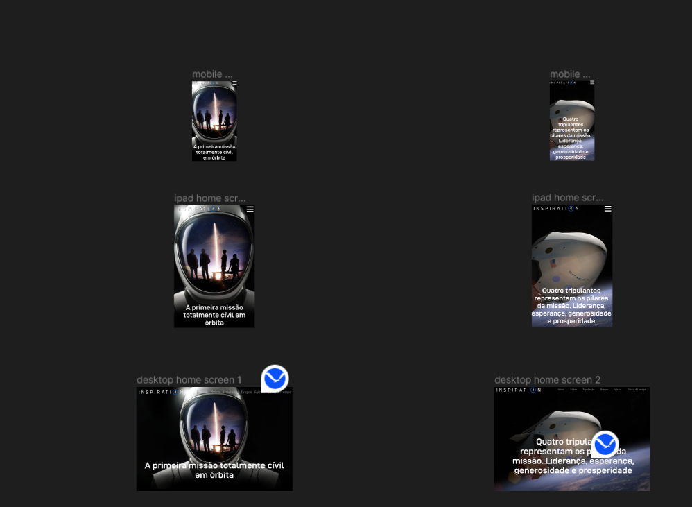
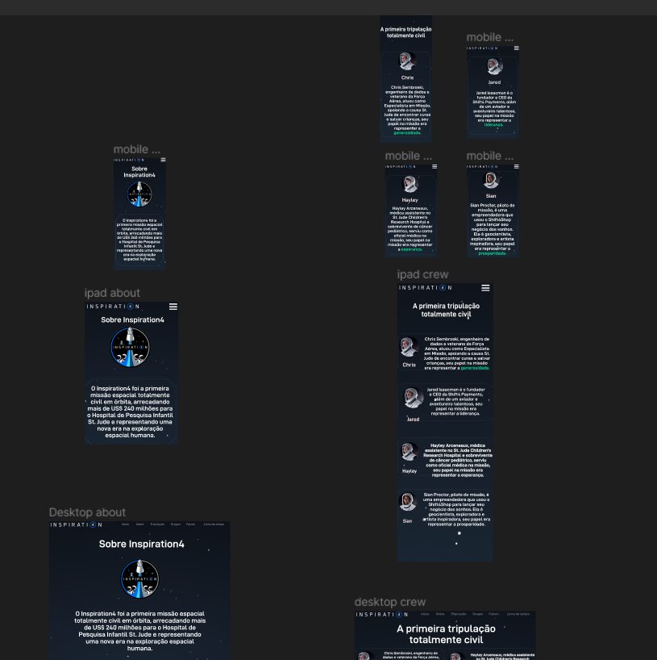
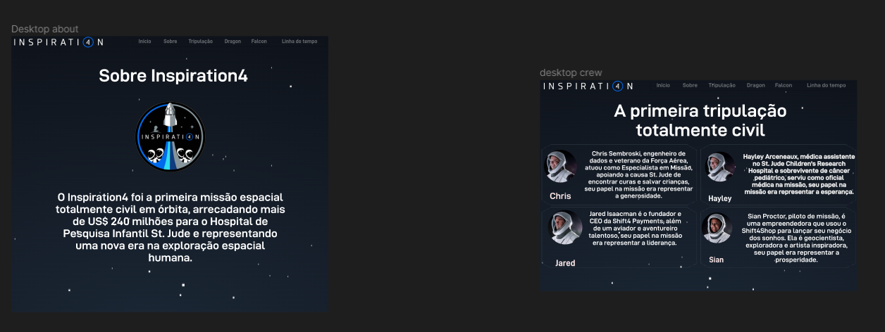

## Inspiration4

### Etapas do projeto:
1. Prototipagem
2. Desenvolvimento do HTML 
3. CSS
4. JavaScript

### Prototipagem
 1. Protótipo de baixa fidelidade
 2. Protótipo de alta filidade

#### Protótipo de baixa fidelidade:

<div>


</div>

Nesse desafio, eu comecei a prototipagem pelo mobile e fui desenvolvendo as telas para tablet e, por último, para desktop. O principal objetivo do desafio era descrever o que foi a missão. Então, no design, eu foquei em organizar os textos e as imagens da forma mais concisa e compreensível que pude.

#### Protótipo final:
<div>



<br>
<div>

### HTML

No HTML, com as frames prontas, eu segui o layout no Figma e digitei as tags, sem muito segredo aqui.

### CSS
O CSS ficou muito extenso devido ao código para criar o efeito das estrelas no fundo, o que o tornou bastante longo. Iniciei a estilização logo após concluir o HTML.
### JavaScript

#### O JavaScript foi desenvolvido em partes:

1. Menu
2. Lógica para a timeline
3. Esconder o header
4. Botão de voltar ao topo


### Inspirado no documentário INSPIRATION4
 Link do documentário: 
https://www.netflix.com/br/title/81441273

 
## Como clonar o repositório
 Você precisa ter o [Git](https://git-scm.com/)  instalado na sua máquina

1. Abra seu terminal ou prompt de comando.
2. Digite o código:
```bash
git clone https://github.com/rafaelcarlosoficial/inspiration
```
